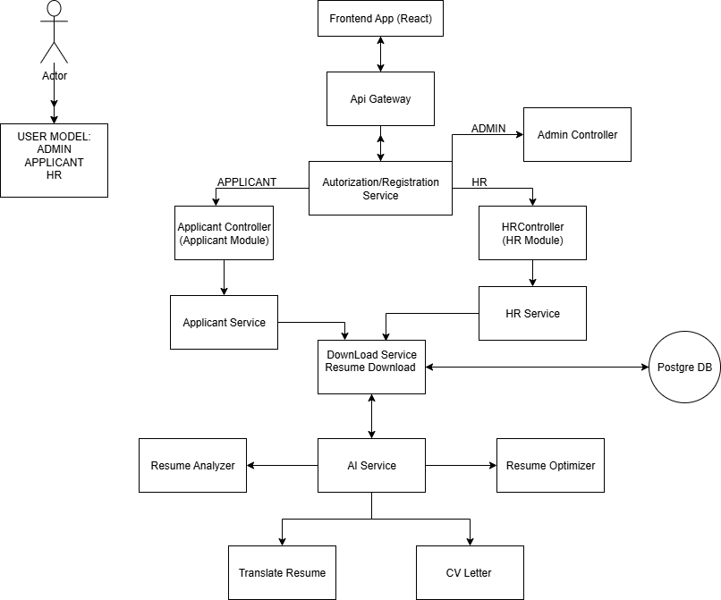

# 📈 HireBoost

**HireBoost** is an AI-powered web application for analyzing, translating, and enhancing resumes, built for job seekers around the world.

## 📌 Key features:
- 📑 Upload your resume in text or PDF format
- 📊 Resume analysis against a selected job position
- 💡 AI-based suggestions for improving your resume
- 🌍 Resume translation into any language using neural networks
- ✍️ Generation of new resume sections based on AI prompts
- 🔐 User registration and login (Google OAuth planned)
- 🎁 One free usage of each feature per user
- 🤝 Referral program

## 📚 Tech stack:
- Java 24
- Spring Boot 3.5
- PostgreSQL
- OpenAI API
- React + Tailwind 
- Docker 

## 📂 Project structure:
